### 性能测试
-----
#### 测试目标
-----
本次测试的目标是测试triton的性能，主要针对kafka

#### 测试方案
-----
因为triton是一个模板化的、插件化的消费者，我们这里的性能测试针对的是triton内部的转发性能，我们不关心后端的业务逻辑，因为业务逻辑千变万化，可能是一个rpc调用，可能是一个数据库操作，如果把业务逻辑加进去，那么这个性能测试就不是针对triton的，变成了对业务逻辑的压测。所以我们使用的模板如下：
```go
funcsMap["self"] = func(v interface{}) (ret string, err error) {
		return "OK", nil
	}
```
业务逻辑没有任务操作，这样我们就能做到只压测triton的转发性能。

我们分别往4个topic中，分别灌入各1000w条，10byte、100byte、1000byte、5000byte的数据，然后我们用triton去消费，观察triton的消费性能。因为我们的4个topic都是3个分区，然后我们分别再测试启动1、3、6个消费者，triton的消费性能。

#### 测试机器
-----
* OS：CentOS Linux release 7.4.1708 (Core)
* CPU: 4
* Memory: 8G

#### 测试过程
-----
##### 1、10byte
-----
我们启动triton，消费者数量为1，从头开始消费10byte中的数据，得到triton的消费情况如下
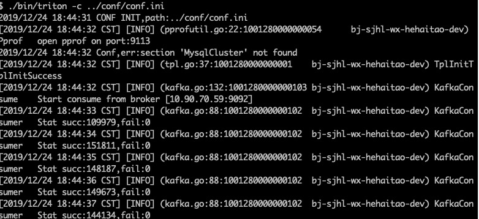

我们可以计算得到每秒消费15w条数据， 此时CPU情况
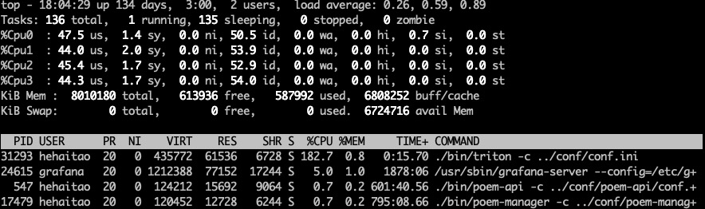

我们增加消费者的数据到3，从头开始消费10byte中的数据，得到triton的消费情况如下

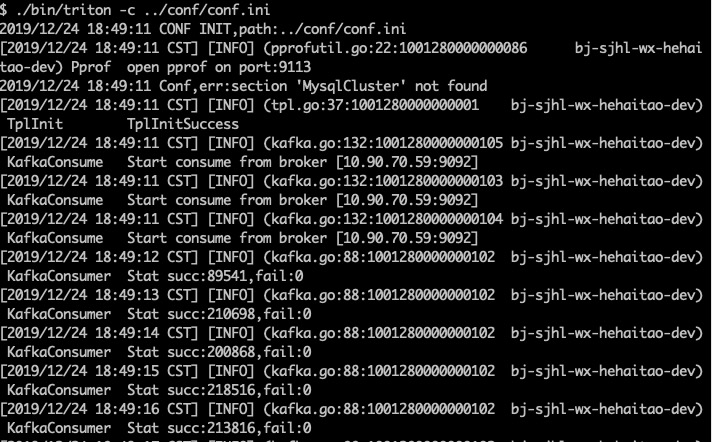

我们可以计算得到每秒消费20w条数据

我们再次增加消费者的数量到6，从头开始消费10byte中的数据，得到triton的消费情况如下
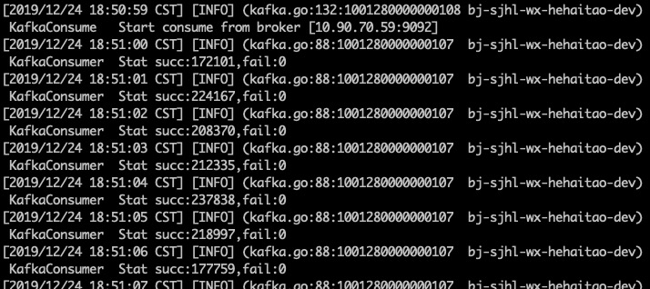
我们可以计算得到每秒消费21w条数据，性能没有明显的提升

##### 2、100byte
-----
我们启动triton，消费者数量为1，从头开始消费100byte中的数据，得到triton的消费情况如下
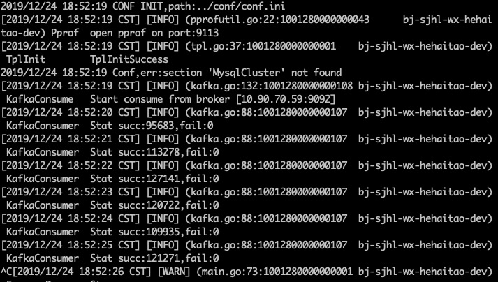

我们可以计算得到每秒消费11.5w条数据

我们增加消费者的数据到3，从头开始消费100byte中的数据，得到triton的消费情况如下
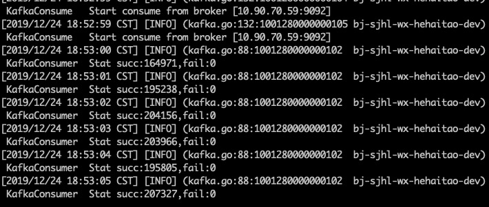

我们可以计算得到每秒消费19.5w条数据

我们再次增加消费者的数量到6，从头开始消费100byte中的数据，得到triton的消费情况如下

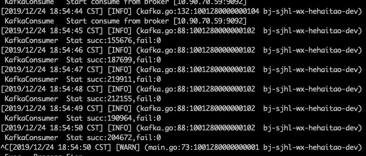
我们可以计算得到每秒消费19.5w条数据，性能没有明显提升

##### 3、1000byte
-----
我们启动triton，消费者数量为1，从头开始消费100byte中的数据，得到triton的消费情况如下
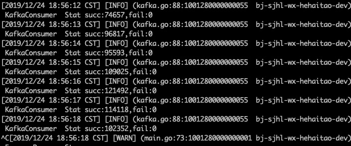

我们可以计算得到每秒消费11w条数据

我们增加消费者的数据到3，从头开始消费1000byte中的数据，得到triton的消费情况如下
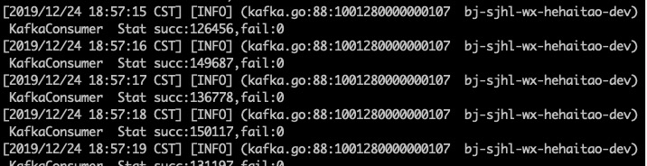
我们可以计算得到每秒消费14w条数据

我们再次增加消费者的数量到6，从头开始消费1000byte中的数据，得到triton的消费情况如下
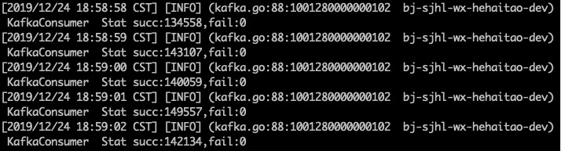
我们可以计算得到每秒消费14w条数据，性能没有明显提升
##### 4、5000byte
-----
我们启动triton，消费者数量为1，从头开始消费5000byte中的数据，得到triton的消费情况如下
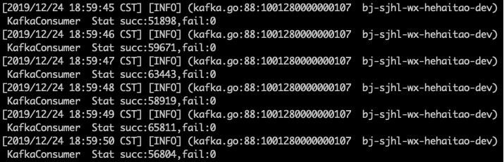

我们可以计算得到每秒消费6w条数据

我们增加消费者的数据到3，从头开始消费5000byte中的数据，得到triton的消费情况如下
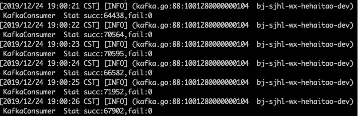
我们可以计算得到每秒消费7w条数据

我们再次增加消费者的数量到6，从头开始消费5000byte中的数据，得到triton的消费情况如下
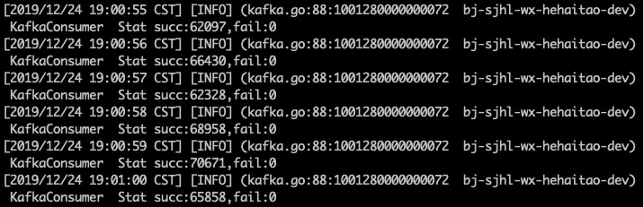
我们可以计算得到每秒消费7w条数据，性能没有明显提升
#### 测试结果
-----
对比各种不同消息长度的测试结果如下表：

| topic        |每条消费大小| 分区数   |  消费者数量  |性能| 消费者数量|性能|消费者数量|性能
| --------   | :-----:|:-----:  | :----:  |:-----:|:-----:|:-----:|:-----:|:-----:
| 10byte     | 10byte|3 |   1     |15w/s |3|20w/s |6|21w/s
| 100byte        |  100byte| 3   |   1   |11.5w/s |3|19.5w/s |6|19.5w/s 
| 1000byte        |    1000byte|3    |  1  | 11w/s|3|14w/s |6|14w/s
| 5000byte        |    5000byte|3    |  1  |6w/s |3|7w/s |6|7w/s

#### 测试结论
-----
由上表可以得出结论：triton的性能与消费者数量相关，最佳情况是与分区数相等，消息体越长，每秒消费条数相应降低，原因是网卡流量已经打满。